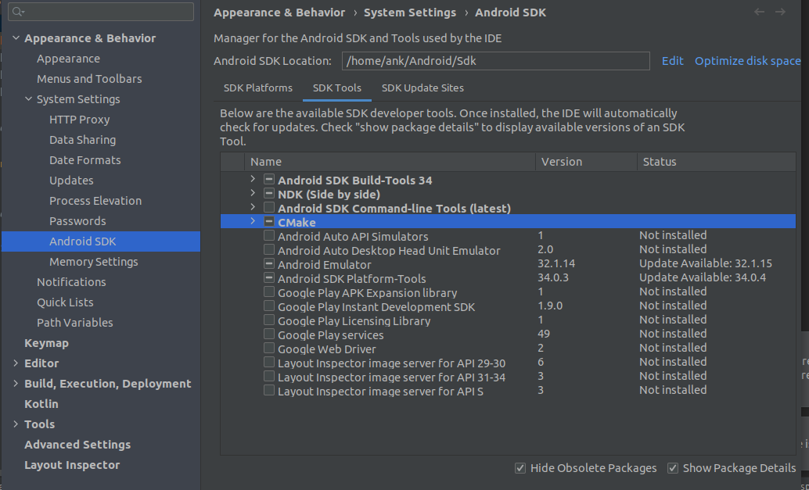
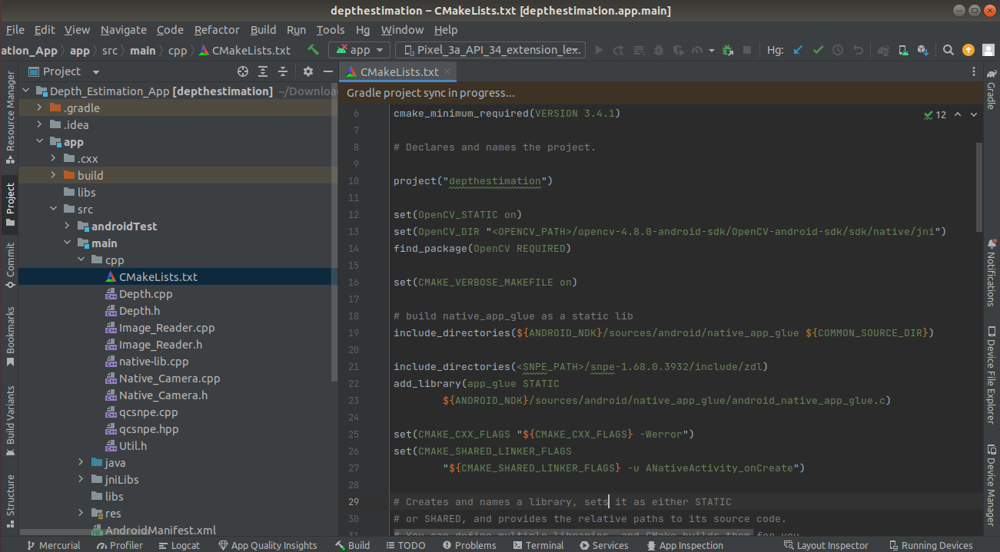
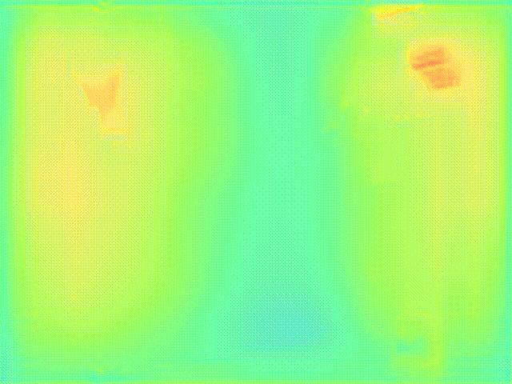
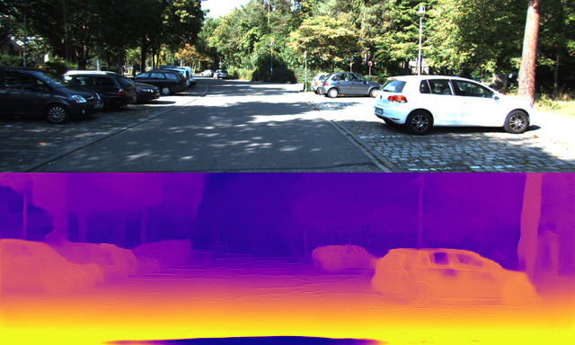

# Depth Estimation on CM2290 with SNPE on Android
## Introduction
This project is intended to build and deploy a depth estimation without depth sensor to generate depth map from RGB camera frames using monocular depth estimation model PackNet-SfM on CM2290 with SNPE on android Application with Integration on Thundercomm TurboX CM2290 LA (Linux Android) DK (Development Kit). which helps to deploy AI Camera Applications on edge device. An android depth estimation API returns the depth estimation map without using the Depth Sensor with help of Deep Learning model from live video. 

## Prerequisites 
- Download and install Android Studio on host system. Refer link: https://developer.android.com/studio?gclid=EAIaIQobChMI8qLmyajE-wIVmX4rCh1npgMDEAAYASAAEgLQAPD_BwE&gclsrc=aw.ds. 
- Install Android Platform tools (ADB, Fastboot) on the host system.
- Download OpenCV android SDK, select releases from library menu and select android. Refer the given link (https://opencv.org/).
- Setup the SNPE SDK in the host system, download SNPE SDK here and select Tools and Resources and Download version snpe -1.68.0.3932.
- Download and Install the Application Tool chain SDK. (Setup instructions can be found in Application SDK User Manual). 
- Connect the Wi-Fi
- Install vyser for screen mirroring .  Refer link 
https://www.vysor.io/download/linux 

## 1. Steps to create android application 
### 1.1 Clone the project
```sh
     $ git clone <source repository>
     $ cd Depth Estimation on CM2290 with SNPE on Android/
```
### 1.2 Open project in android studio 
1. Open android studio 
2. Click on File-> open-> select <FOLDER_TO_OPEN>->  OK-> open in New_window

   `Note : Wait till Gradle sync finishes successfully.   `

3. After opening the folder Depth Estimation on CM2290 with SNPE on Andriod in Android studio select the SDK Manager icon in that select SDK Tools and check the Show Package Details. 

4. In the NDK section select version 17.2 version and CMake of 3.18.1 and click on apply. This will download the Android NDK and CMake required by SNPE SDK.

   

5. Go to ‘CMakeLists.txt’ file and make the following changes for setting up OPENCV_DIR and include directories of SNPE SDK.
  - set(OpenCV_DIR "<opencv_directory>/opencv-4.8.0-android-sdk/OpenCV-android-sdk/sdk/native/jni").
  - include_directories(<SNPE_ROOT>/include/zdl) 

    

### 1.3 Gradle file 
- Set sdk directory in local.properties file  

```sh
sdk.dir=<PATH_TO>/Android/Sdk 
```
### 1.4 Manifest declarations 
make sure that manifest file has the appropriate declarations to allow use of camera hardware and other related features. 
- Camera Permission  
Your application must request permission to use a device camera. 
```sh
<uses-permission android:name="android.permission.CAMERA" /> 
```
- Camera Features  
Your application must also declare use of camera features, for example:  
```sh
<uses-feature android:name="android.hardware.camera" /> 
```
- Storage Permission  
Your application can save images or videos to the device's external storage (SD Card)  
```sh
<uses-permission android:name="android.permission.WRITE_EXTERNAL_STORAGE" /> 
```
- Change the contents in application tag as shown below 
```sh
<application 
    android:allowBackup="true" 
    android:dataExtractionRules="@xml/data_extraction_rules" 
    android:fullBackupContent="@xml/backup_rules" 
    android:icon="@mipmap/ic_launcher" 
    android:label="@string/app_name" 
    android:roundIcon="@mipmap/ic_launcher_round" 
    android:supportsRtl="true" 
    android:theme="@style/Theme.CamPAs2" 
    tools:targetApi="31"> 
    <activity 
        android:name=".MainActivity" 
        android:exported="true" 
 
        android:screenOrientation="landscape"> 
        <intent-filter> 
            <action android:name="android.intent.action.MAIN" /> 
            <category android:name="android.intent.category.LAUNCHER" /> 
        </intent-filter> 
 
        <meta-data 
            android:name="android.app.lib_name" 
            android:value="" /> 
    </activity> 
</application> 
```
 
  
## 2. Steps to Run Depth Estimation on CM2290 with SNPE on Android Application:

Before running the application set the board environment by following below steps:

1. Connect kit to the host system, enter following adb commands
```sh
   $ adb root
   $ adb disable-verity
   $ adb reboot
   $ adb root
   $ adb remount
```   

2. Turn on Wifi in android kit. Select the available Wifi by entering password.

3. Set the latest UTC time and date in setting->Date and time setting.

4. Copy the Library files of snpe 1.68.0.3932 on to the kit from host system.
```sh
   $ adb push <SNPE_ROOT>/lib/arm-android-clang8.0/ /system/lib/
```
5. Copy the DSP files of snpe 1.68.0.3932 on to the kit from host system.
```sh
   $ adb push <SNPE_ROOT>/lib/dsp/ /system/vendor/lib/rfsa/adsp/
```
6. Copy the libcdsprpc.so file from “/vendor/lib” folder to “/system/lib” folder
```sh
   $ adb shell 
   $ cp /vendor/lib/libcdsprpc.so ./system/lib/
```
7. Pushing the required database files to internal storage of device.
```sh
  - $ cd storage/emulated/0/   
    $ mkdir appData
    $ exit

  - $ adb shell
    $ adb push Depth Estimation on CM2290 with SNPE on Android/models/depth_model.dlc /storage/emulated/0/appData/models/   
   
```   

## 3. Steps for running the main application are as follows:

1. Go to android studio and generate APK file for Depth Estimation on CM2290 with SNPE on Android.

    - Once the build successful, go to Build menu and select Build
    Bundle(s)/APK(s) from the dropdown then select Build APK(s).

    - Above step will download APK file in the following directory.  
    Depth Estimation on CM2290 with SNPE on Android/app/build/outputs/apk/debug/app-debug.apk

2. Install APK file on CM2290 kit.
```sh
   $ cd Depth Estimation on CM2290 with SNPE on Android/app/build/outputs/apk/debug/
   $ adb install app-debug.apk
```
3. Open the application on device. 

    **Note** : Alternate way to run application on device.
 
    - Make sure that device is properly connected to host system. 
    - Go to android studio on host system and from menu click on run option it will launch application on device.   
 
4. Once the application opens allow the camera permissions. It will open the live camera and keeps taking the camera frames.

5. Depth estimated image and video saved on the device in model folder.

6. Download depth estimated image/video from device to host system.
```sh
   $ adb pull /storage/emulated/0/models/depth_image.jpg /home/
   $ adb pull /storage/emulated/0/models/depth_video.avi /home/
```

## 4. Results

Depth Estimation video out of CM2290 device on live video as shown below. 



Depth Estimation on reference video with PackNet-SfM model


Depth Estimation on reference image with PackNet-SfM model




